+++
title = "My Slightly Overcomplicated Homelab: Part 1: Motivation, Hardware & Design"
date = 2026-08-03
description = "A slightly chaotic but practical story of how I built an overcomplicated Raspberry Pi homelab to escape subscription hell and take back control of my data, walking through the hardware choices, storage tradeoffs, and all the DIY hacks along the way."
[extra]
featured = true
tags=["tech", "self-hosting", "linux", "hiring-managers"]
+++

# The Motivation

Last year I undertook one of the biggest projects of mine till date. Being a software developer in 2026 is no joke, where you are in a constant battle against AI and staying relevant with countless new technologies being vibe coded at the speed of light. Not only that suddenly everything is being rewritten in Rust.
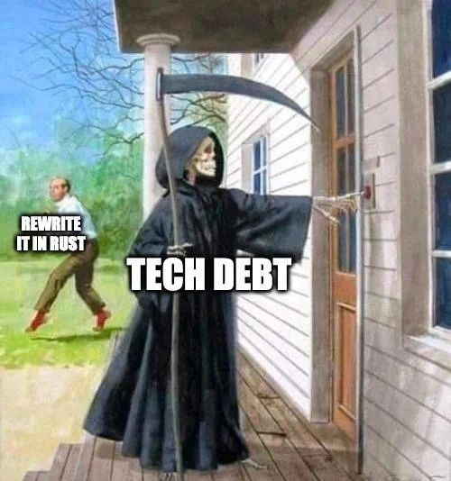

How dare you not use the _blazingly fast_ framework that launched 2 hours ago?

The other thing that really grinds my gears is the countless _subscriptions_ being shoved down our throats as of late. I would not be surprised if not even a single human being on earth likes subscriptions. Sure, there are arguments on how subscriptions are good yada yada. But I like the concept of ownership and I am not happy with _not owning the stuff I pay for_.

The subscription plague has infested everything from a bottle of milk to the ability to [use your car](https://www.businessinsider.com/tesla-pulls-plug-on-one-time-purchases-of-fsd-2026-2).

I was sitting one day making a list of the things that I am subscribed to and it was shocking how much I was getting leeched every month with subscriptions.

- Spotify **₹199**
- YouTube Premium **₹149**
- Google One **₹650**
- ChatGPT **₹1950**
- Netflix **₹499**
- Amazon Prime **₹1499/yr**
- Hotstar **₹299**
- Truecaller **₹199**

That's around **₹4000** just the apps I had on my phone, on top of it, I have the internet bills, electricity bills, rent; just too much stuff to track.

Sure one could argue that I could cancel some of these, but that is the problem everything will have a major compromise attached to it, to watch a decent selection of shows you need to have 5 different subscriptions, YouTube ads are unbearable and so are Spotify ads, the YouTube music recommendation algorithm is not good. You need Google Photos' premium tiers to back up anything significant or you'll stop receiving emails. You have to subscribe to Hotstar because you want to watch Cricket. You are forever chained to Amazon Prime because I bought into their credit card, which gets progressively [worse every year](https://economictimes.indiatimes.com/wealth/spend/icici-bank-credit-card-rule-changes-from-january-15-2026-check-new-fees-and-benefits/articleshow/126430662.cms?from=mdr).

I had to do something about it!

# The Journey

The most powerful thing about being a developer is that you can literally build anything. But in 2026 building the 50 billionth CRUD application or TODO List wasn't my plan.

I set out to build my own **home server** from scratch to replace all my subscriptions.

> ## User Story: The Sovereign Data Architect
>
> As a privacy-conscious power user, I want to host my own suite of digital services (storage, media, and backups) on my own hardware,
> So that I can eliminate monthly subscription fees, maintain total ownership of my data, and access my files securely from anywhere in the world without compromising on performance or redundancy.
>
> ### Acceptance Criteria
>
> _Storage:_ Replaces Google Drive/Photos with automated mobile syncing (Immich/Nextcloud).\
>
> _Media:_ Replaces Spotify, Netflix, and alike with a self-hosted library (Plex/Jellyfin/Arr stack).
>
> _AI:_ Replaces ChatGPT/Claude subscriptions; no need to jump providers every month for the latest SOTA.
>
> _Maintenance:_ Seamless, automated updates (Watchtower) and a centralized dashboard for "set-and-forget" upkeep.
>
> _Availability:_ Accessible via a secure "tunnel" (Cloudflare) or mesh VPN (Tailscale) outside the home network.
>
> _Redundancy:_ Data must survive a single (or double) hard drive failure (RAID/ZFS/BTRFS).
>
> _Backups:_ Follows the 3-2-1 rule (3 copies, 2 different media, 1 offsite).

I set off on the journey which at this point has taken about a year and multiple iterations and I am finally at something that works and I am proud of.

Low and behold **THE HOMELAB**

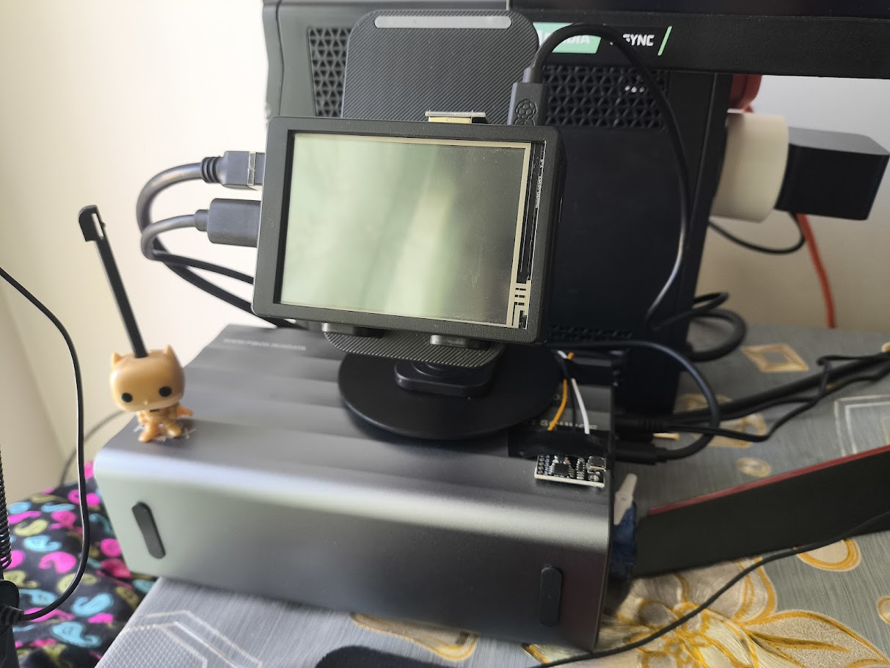

It may look a little ugly but it has taken a lot of effort to get to this point, and it sure as hell was not an easy task, requiring multiple iterations to get things to where I wanted.

The specs/features are as follows:

1. Raspberry Pi 5 4GB variant running Raspberry Pi OS actively cooled with the official cooler as well as an additional giant fan.
2. Full touchscreen display 640x480 resolution, can display dashboards and critical data.
3. 64GB boot drive (SD card (more on this choice below))
4. 2x2TB Seagate Barracuda 7200RPM 3.5 inch drives running in `btrfs` RAID 1 config, along with encrypted monthly backups at Backblaze B2.
5. Monthly data backups and system image backups.
6. Full data encryption with LUKS.
7. 2 hours of backup power
8. Remote operation, auto power on and off.
9. All other things in the Acceptance Criteria regarding software.

Let's now delve into the gory technical details and why it was not so easy to do!

## Stage 1: The Hardware

Well this was a tough decision, I spent a decent bit of time debating this, since I wanted hardware which was:

|                  |                                                                                                                            |
| :--------------- | :------------------------------------------------------------------------------------------------------------------------: |
| Cheap            |                    If money wasn't a problem I would just keep the subscriptions or just buy a TrueNAS                     |
| Modular          |                             Stuff breaks, can't be replacing the whole ship if there is a leak                             |
| Easily Available |          The hardware itself should be available, if I want to find a replacement, I should have multiple options          |
| Performant       | We would not be running GTA VI on the thing but it should handle 4 people using 1080p streams in my house at the same time |
| Support          |                                          Linux support on the hardware is a must                                           |

The first contender that I thought of was using an **HP Elitedesk 800**, these are known good contenders in the homelabbing community, because they are cheap and readily available as refurbished since the corporates parted ways with lil fellas in the due course of time.

I was eyeing out one of the PCs for a long time. The main problem was that they featured a full desktop-grade CPU hence their idle power draw was significant, I would for sure need a UPS to run them reliably since my locality is riddled with power cuts.

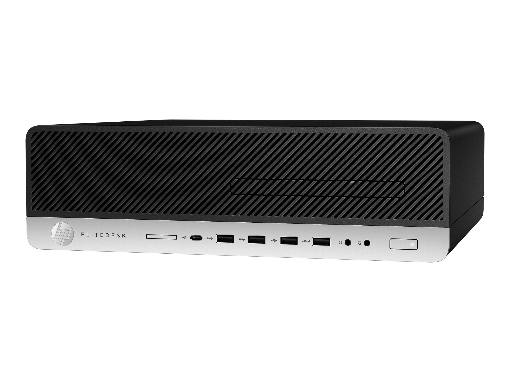 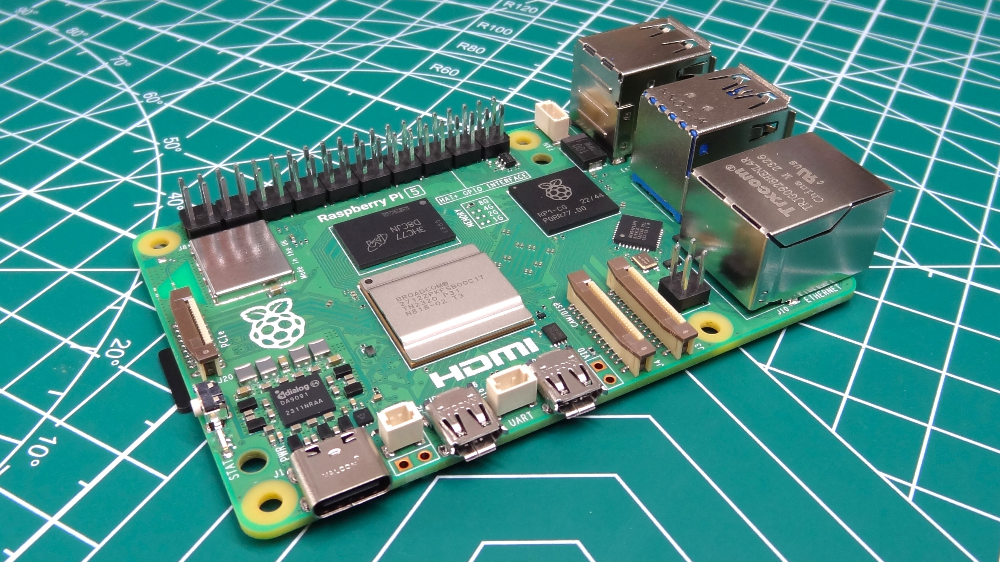
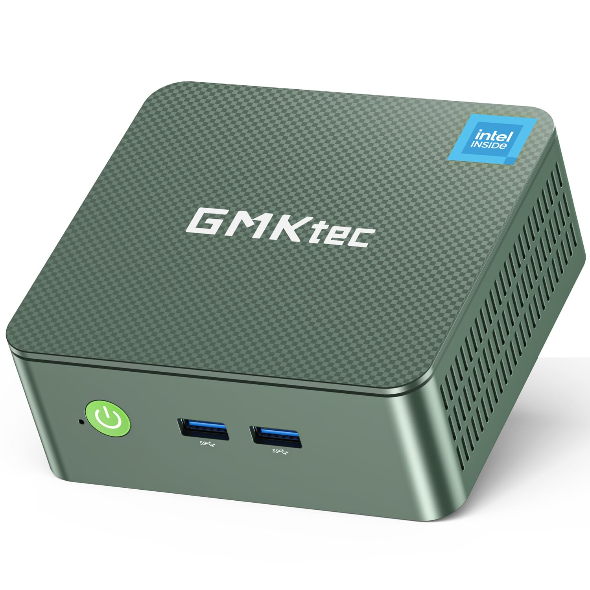

 

Plus they were going for an insane price of **₹15000** or more on Amazon, with no support if things went south. Being a refurbished PC there is always that uncertainty in mind about how they were refurbished.

The other candidate which was on my radar was the Raspberry Pi 5, with a massive community around it and me having tinkered with Pis in the past, I knew it fit the bill, it was way cheaper and had GPIO if I wanted a dashboard or wanted to drive some other peripheral.

For the newer PCs I also considered a GMKTEC NUC or any other SFF PCs, heck I even thought of a full sized tower since that would mean I have an easy path to install hard drives.

The Raspberry Pi 5 came out on top after a lot of consideration. It had really good Linux support.

### The Storage Problem

Since I was going with the Raspberry Pi 5, I had no way to add a storage array, well I had a way I could use the 4 PCIe gen 3 lanes on the Pi and buy a SATA splitter, but that would limit me to using 2.5 inch SATA drives. And everything would not fit in a clean rigid chassis, imagine getting your whole cloud not working because you sneezed in front of your setup.

And was speed really necessary for me? I had to take a moment and think, if I did use the PCIe lanes of the PI, I would get decent speeds for sure, but does that matter if I cannot transfer that speed to the actual consumers?

I only have a Gigabit Ethernet connection in my house, that in itself is a luxury, the top speeds I get are 900 Mbps that's around 120 MBps.

Higher speeds are possible via 2.5G or 10G Ethernet but it's very scarce in India, and so is WiFi 6, I could get a better router and have my ISP configure that for me, but that would only apply to the local connection which doesn't benefit me if I am accessing the server from outside.

The cheapest logical way to go here was going with a drive bay and hooking the Pi with USB 3 on it. Again the main reason to do this was that I wanted a screen on top which would restrict the placement of any HAT whatsoever and at this point I had already planned and bought the Pi, displays and had ordered a 3D print of a nice case I found online to go with it.

Finding a drive bay is also very difficult, you want something with external power since the 5v 1.5amps on the Pi is nowhere near enough to drive the hard drives. The reason I went with hard drives instead of SSDs is the [NVMe crisis of 2026](https://www.linkedin.com/posts/floydchristofferson_the-storage-squeeze-of-2026-activity-7427400047891271681-hnp2), thanks to AI an SSD costs a kidney and a liver now. Even the 2 hard drives cost me a ridiculous amount of money to obtain.

There are a lot of cheap bays which don't have proper power management and S.M.A.R.T passthrough. After searching for a while I located one from PiBOX India. PiBOX is an Indian manufacturer who acquires genuine parts and seems to program the devices themselves.

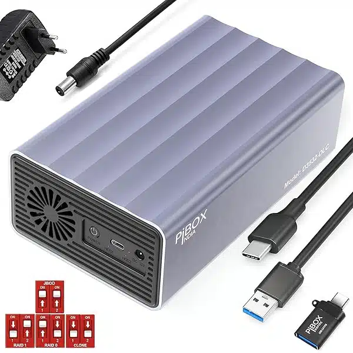

It is really good, they explicitly mention SMART support and it has a relatively known Realtek controller.It supports 2 3.5 inch drives with upto 56 TBs of storage that means it can fit 2, 28 TB IronWolfs which I am too poor to afford.

It has USB C support and active cooling as well. I placed the order.

Like I mentioned obtaining the storage was relatively easy since I chose hard drives and the NVME crisis had not peaked.

For the boot drive I went with the official RaspberryPi SD card which has some extra features, I went with 64 gigs again I could have gone with an SSD but I sacrificed it due to my desire for a display.

### Accessories and Additional things

Apart from this I had to buy:

1. The screen itself
2. Long Cat6 cable (which I got scammed on multiple times)
3. A UPS, the power cuts are really annoying
4. Rpi power supply
5. Bunch of Wipro Smart Plugs (we will see more in the software part)

### Putting it all together

Oh boy this is where the real fun begins.

Assembling the Pi, the display and the case was relatively easy until I found out one of the fins of my heatsink would not sit right with the screen on top.

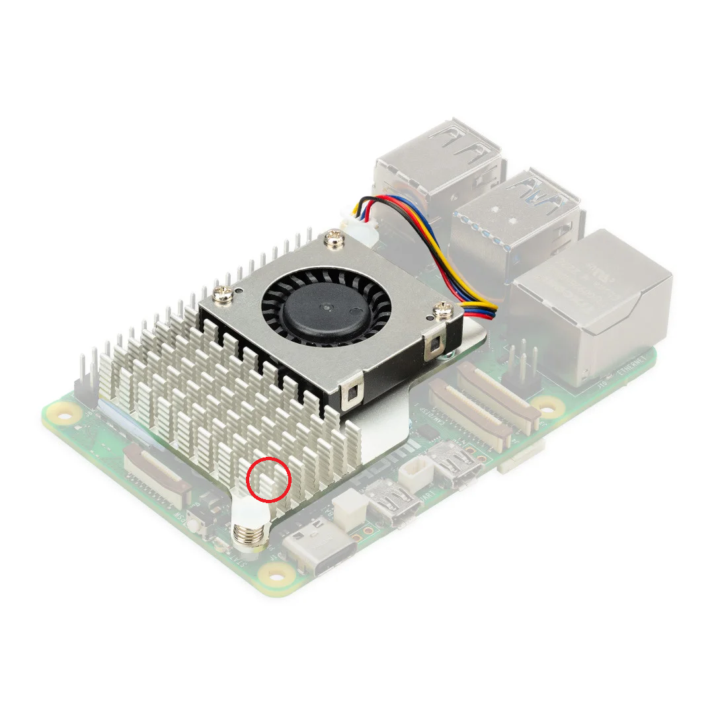

I had to saw that thing off, we are off to a great start.

<iframe width="560" height="315" src="https://www.youtube.com/embed/Hywq3eGeAwM?si=KidCI0lLHDC9CHuf" title="YouTube video player" frameborder="0" allow="accelerometer; autoplay; clipboard-write; encrypted-media; gyroscope; picture-in-picture; web-share" referrerpolicy="strict-origin-when-cross-origin" allowfullscreen></iframe>
  
Once that was done we were finally booted on to the Raspberry Pi OS, I installed the drivers for the display and tested things out. It was working, over the next couple of days I noticed issues with the setup.

#### The infinite LCD Glow

The display I bought seems hard wired to the 5v pin on the GPIO of the PI, hence I cannot turn it off no matter what, even when it's off it will keep glowing bright white. There are absolutely no controls whatsoever.
 
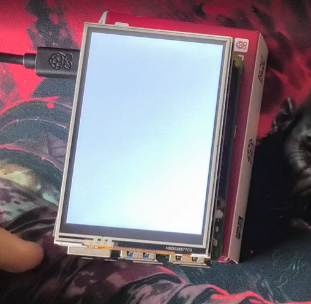

After trying for a long time, I settled that this display was a no go, but my 3D printed case had a massive hole for the display and at this point I had sacrificed a lot of things just to have that display over there.

I had to buy another display from Waveshare 😭 this time I made sure that it had HDMI and can be shut off.

The display arrives and it has 5 buttons on the side to control the things, but it works over HDMI and can be turned off, no fancy DDC/CI controls hence no controlling other parameters such as brightness contrast etc. through it.

When I went ahead to put it together I found out that the old case had no room to fit the HDMI slot on top of the display and the 5 buttons to the side.

Now I had two options either to remodel the 3d print or heat a knife and cut the plastic. I chose option 2.

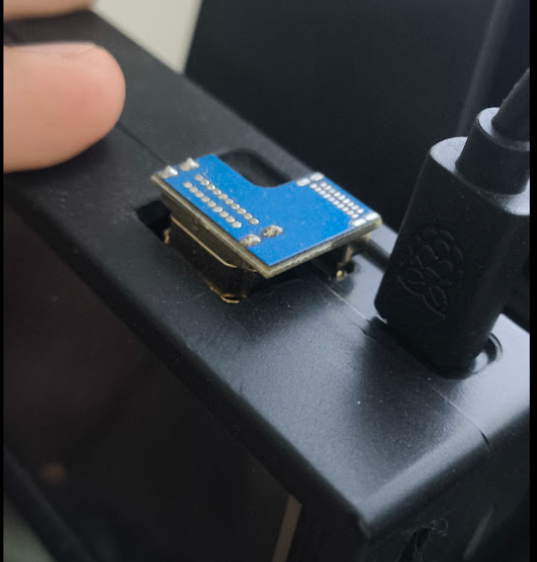

Even after all that, it was still a very snug fit, and I managed to break one of the tiny fragile switches on the side of the LCD.

I could have just left it there, since it was the left arrow button on the monitor settings menu, but my OCD would not let me do that. I bought replacement switches and re soldered that button 😩.

#### The drive bay would not turn on

I had set up the Raspberry Pi to auto turn on as soon as power was supplied. But the drive bay had a little button which needed to be pressed in order for it to start.

In case there was a power failure and my UPS power dies then the drive bay would never come up. Obviously this would normally not be a problem, but I had invested in a lot of smart plugs and wanted a fully remote controllable startup and shutdown sequence.

I rigged a `ATTINY85` microcontroller and an `SG90` servo and programmed it to act as a button pusher, as soon as the power comes on, this moves 37 degrees which I measured exactly and retracts, then the power is cut to it.

This setup is super cheap and the `attiny` has built in Micro USB for power and a reliable timer. Although you should never directly power the servo from the microcontrollers 5v pin, I didn't think much of it since I would never have the servo at full stall torque.

I found out later one night where a shutdown sequence had failed and my microcontroller had browned out. I did it right this time with a separate power supply and a capacitor between the pins of the servo so I don't propagate the current dip to the microcontroller. I came up with the following _abomination_:

	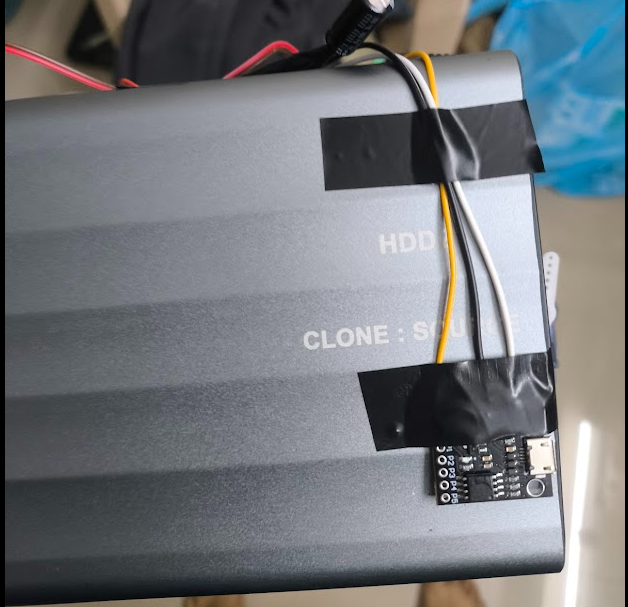
	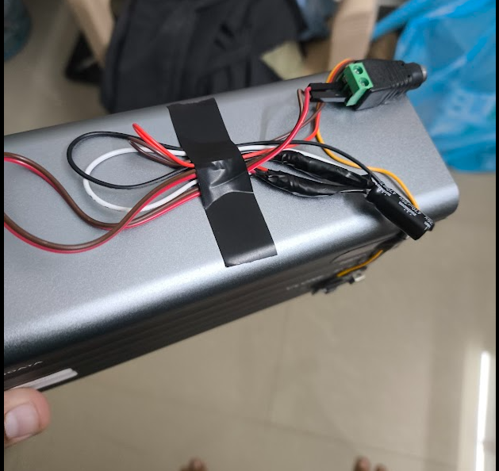
	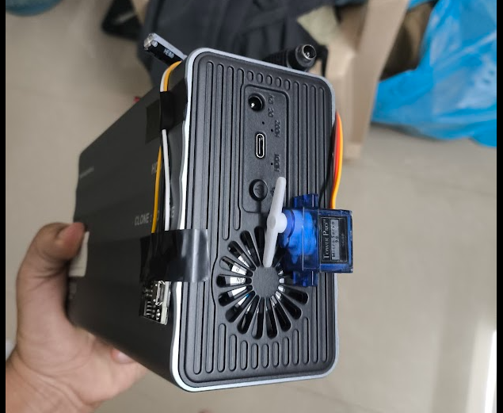

With this the hardware part was done. This blog has already become too long, we will continue this in the Next chapter. This 100 story pointer is still under `implementation`.

If you stuck till here, thanks a lot! you are a real one 💖.
