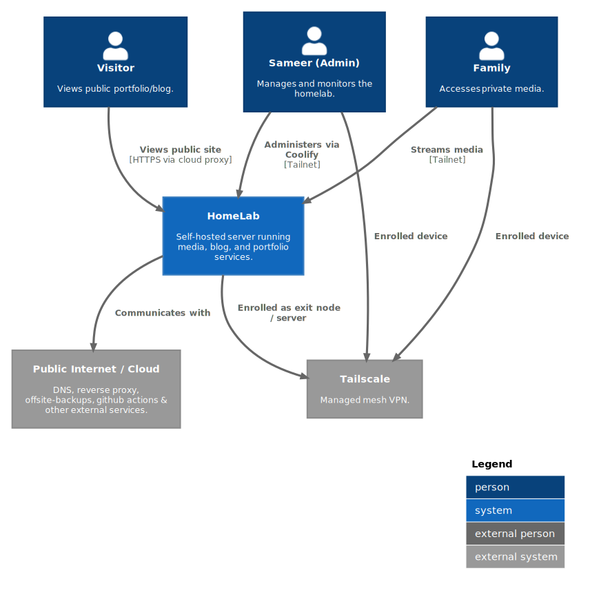
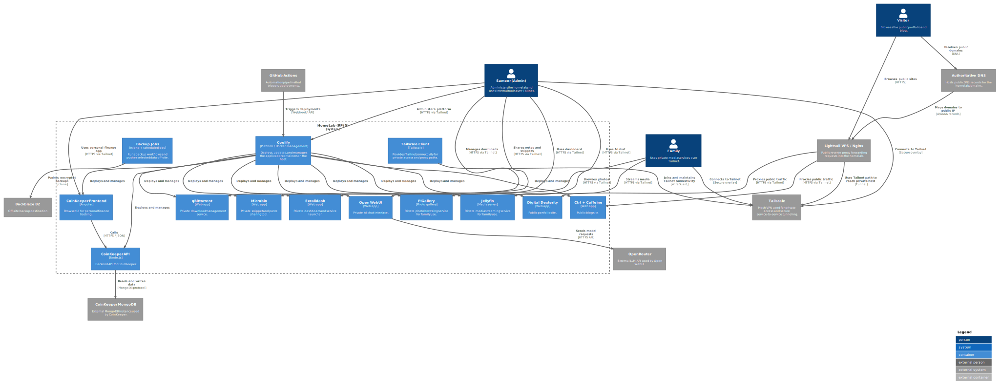
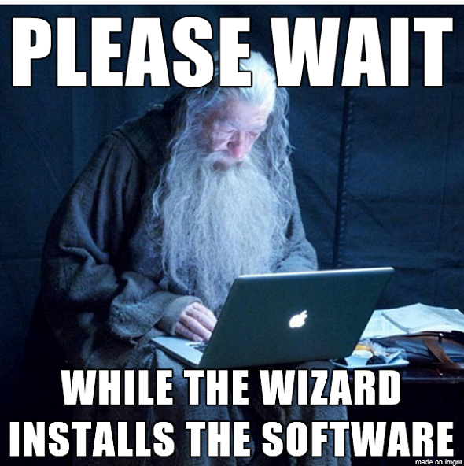
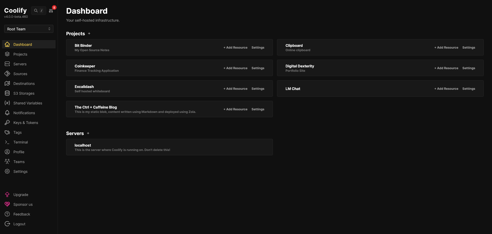
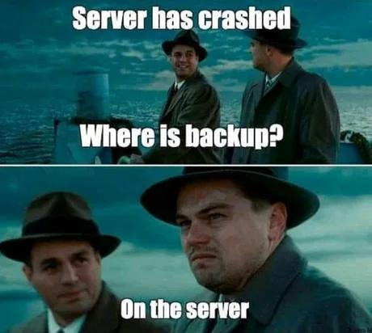
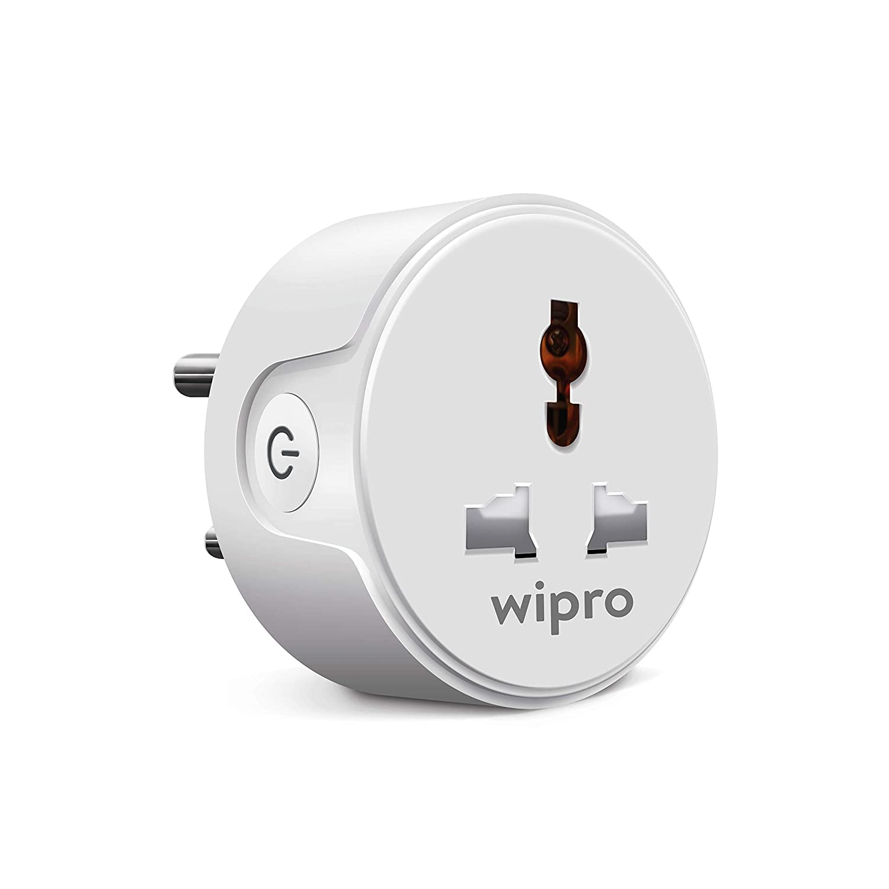
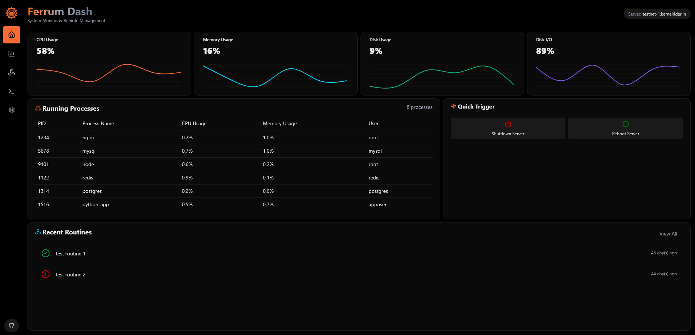

+++
title = "My Slightly Overcomplicated Homelab: Part 2: Software, Maintenance & Verdict"
date = 2026-08-03
description = "The second part of my chaotic homelab adventure: the software stack, backups, maintenance, remote access, and whether the whole thing was worth it."
[extra]
featured = true
tags=["tech", "self-hosting", "linux", "hiring-managers"]
+++

Hey there! Good to see you. This is Part 2 of my two-part blog about my slightly overcomplicated homelab. If you have not read Part I, you can do that [here](https://blog.kernelrider.in).

In this part, we will see how I manage to run over 13 different projects on a single Raspberry Pi, how updates are handled, and how backups and security work. This was far less chaotic than the hardware part, but chaotic nonetheless.

Before we begin, here are the C1 and C2 architecture diagrams in case anyone wants a high-level overview before jumping in.

<figure>
  
  <figcaption>C1 (Component) Diagram </figcaption>
</figure>

<figure>
  
  <figcaption>C2 (Container) Diagram </figcaption>
</figure>

# The System

I had finally finished all the assembly and booted into Raspberry Pi OS. The new LCD screen was attached, the network was up, and things were looking promising. I should mention that I had to reinstall the OS twice. The first time, I forgot to set up `ssh` and a hostname before flashing, and for some reason the unit was not listening on the usual mDNS address. The second time was when I found out I could not control the display backlight without using the full Raspberry Pi OS, meaning the GUI version. I had installed the Lite version with just the CLI because I wanted to show off as a wannabe cool hackerman. I could have gone from CLI to GUI by installing a desktop environment, but who wants that headache.

Once I booted up, I checked whether both drives were showing up. They were. I installed the display drivers and set up screen cropping at the hardware level. This was because the case that I had sawed off like a caveman had imperfections, and it covered around 3 to 4 pixels on the left side of the screen. With that, we were finally up and ready for "software."



### Setting up `btrfs`, `RAID` and encryption on the disks

This was the first and most crucial step. A bot that once could not count how many r's there are in _strawberry_ was of massive help here. Though it did make me delete my filesystem twice, and hey, we all make mistakes, it was still pretty helpful.

I got the two drives set up in `RAID 1` to ensure local redundancy. I did a quick speed test and was getting about `170 MB/s`, that is megabytes with a capital B. Not the fastest, but as we saw in the previous part, USB 3 was hardly going to be the bottleneck.

**Why `btrfs`?** TL;DR: online RAID conversion, no need to reformat, and if I want to go from `RAID 1` to `RAID 10` in the future, it can be done as an online operation. Also, the name is cool. "Better FS." Although I call it "butter fs" since it was pretty smooth, unlike 99% of the Linux commands I run.

Quick `btrfs device stats`: all green. I also checked the `SMART` data and the spinny boys were in good shape.

Putting the command here because `smartctl` was not able to figure out the interface type:

```bash
sudo smartctl -d sat -a /dev/sda
```

I did run into an issue with the hard drives. I had the janky button pusher pressing the button as soon as power was cut. Here is the photo again if you do not remember it.


It was working as expected, though I had to manually trigger it at that point. But it was causing `unexpected_power_loss` errors in `SMART`; somehow the drives were not going into standby during shutdown. I had to create a `systemd` script that ran at the very end of boot to issue an aggressive `hdparm` command to park the heads, since the `smartctl` standby command did not work.

Next, I needed to set up encryption. By encryption, I do not mean encrypting the root drive, since I need auto-login and nobody is going to sit there typing a password every time the server boots. I mean the data disks. On Linux, this is done using `LUKS`. It was not a hard requirement for me, since the odds of someone physically stealing the drives are pretty low. Another factor at play here was the Raspberry Pi 5's `BCM2712` processor, which does not have a dedicated `AES` chip. That means encryption and decryption have to be handled in software, causing a fair bit of load. After researching it a bit, I was pretty sure the Pi 5 could wing it nonetheless. The main reason was warranty claims and paranoia. I have had a very strict security policy at work for a while, and it eventually became a habit. What if a drive dies and I have to RMA it? Seagate probably does wipe drives properly and has huge compliance disclaimers saying so, but why risk it.

I did the necessary and made sure to back up the drive filesystem headers and the encryption key.

### Deployment A (The local containers)

I needed to deploy a lot of stuff. Like, a lot. I was also planning to migrate all my _NEVER FINISHED_ college projects here. On top of that, I needed to deploy third-party services and have a way to monitor, automate, and update everything.

The obvious choice was `docker`, since almost everything has a Docker image now. But I needed some kind of orchestration, and I did not want to do everything by hand. Maybe 10 years ago.

One FOSS project called `coolify` had been on my radar for a long time, ever since I saw it in a YouTube short. It is basically a self-hosted cloud platform, and it has a tonne of features:

1. Docker based
2. Easy deployment templates for your 500th vibe coded `next.js` app.
3. Logging
4. Notifications
5. Automatic cert setup
6. Nice GUI
7. Auto updates & backup options to S3 etc. etc.

It was a perfect choice. I installed it with a run script, although I rarely trust those, and it was good to go. I instantly landed on the beautiful home screen.



The screengrab is a bit dated and comes from somewhere in the middle of the timeline.

I started small, deploying one thing at a time, based on the acceptance criteria I had set. The first containers I deployed were:

1. Jellyfin -> Self Hosted Netflix Alternative
2. OpenWebUI -> ChatGPT/Claude Subscription
3. PiGallery2 -> Google Photos Alternative

The Pi was holding up pretty well with these three.
I also set up a local SMB share for file storage.

### Deployment B: Public Front, Domain & Access Restrictions

The next step was not in the plan. I had a domain lying around that was originally meant for a Vercel-hosted portfolio, and the thought occurred to me: why not move all deployments to the Pi?

Making that work required navigating a few hurdles. Unlike Vercel, there was no static IP, and getting one from the ISP was not an option. The only viable solution was to put a reverse proxy in front of the Pi and forward requests through a secure tunnel. Nginx works well for this and, while writing configs from memory is not my strong suit, our "AI overlords" are usually supposed to be decent at it.

A Lightsail VPS was acquired on a dormant AWS account. It did not need to be powerful, and a VPS helps prevent a heart-attack bill while offering basic DoS protection. $5 a month bought a modest system with 0.5 cores, 2 GB RAM, 20 GB storage, and 0.5 TB of transfer. That is South Mumbai AWS for you: half the limits for the same price. But realistically, the public route was not going to hit that limit just to serve some JavaScript bundles, looking at you, React.

After installing Nginx and pointing the CNAME to the VPS's public IPv4, I configured Tailscale. Then came the "way too much time" spent on Nginx configs. I never said I was good at it, but you were supposed to be, ChatGPT 😡.

Things were finally working. Once I got one service working, the rest was fairly straightforward. I just needed to add sensible subdomains and keep expanding. The list grew:

1. [Digital Dexterity (My Portfolio)](https://kernelrider.in)
2. [CoinKeeper](https://coinkeeper.kernelrider.in)
3. [The Ctrl + Caffeine Blog](https://blog.kernelrider.in)
4. [BitBinder (My Open Source Notes)](https://notes.kernelrider.in)

And other FOSS utilities: 5. [Microbin](https://clip.kernelrider.in) (Online Clipboard for sharing text) 6. Excalidash (Excalidraw+ FOSS alternative) 7. qBittorrent (For downloading Linux ISOs, of course)

That is a fair collection of containers, and the Pi surprisingly had no issues, even though only two of them are static sites.

I had to set up firewalls and restrict some of the containers so they were only accessible via the Tailnet. These included the Jellyfin server, the Coolify admin dashboard, and PiGallery2.

Although authentication is set up for everything, it is all self-hosted and local, and restricting access through a secure tunnel is added peace of mind.

### Backups



We have all been there. A project of this caliber cannot go without backups. There are a few layers here, so let us go through them one by one.

#### Data Drives

I already had some redundancy by using `RAID 1`, but I wanted to at least graze the godliness of _3:2:1_ backups for my data.

While having full 3:2:1 is nice, it is expensive and harder to manage in general. So in my case, I went with one offsite backup to `Backblaze B2`.

 Well buster, the main reason is that it is cheap. As of now, backing up around 800 gigs of data is costing me about $4 each month. It is S3-compatible, and egress is free. 

The tool for the job was `rclone`. It supports just about every cloud provider you can imagine. The setup is simple: set up a `b2` layer as the base and then set up a `crypt` layer on top. After saving the keys securely, I pushed some data and tested a restore. Everything seemed to work.

I had a hard time setting up the ignore rules, but there is plenty of documentation around.

#### Coolify Backups

Coolify has a built-in backup and restore mechanism. I have not bothered to set it up yet because, frankly, it is a drag and I have a cheat code since I am using a Pi.

#### System Backups

While backups for the media drives are important, we also need to remember that the system is running off a single A2-class SD card, which is not exactly the most reliable thing in the world, even if you buy a good one. Plus, restoring everything including encryption and Coolify would be a huge pain.

Luckily, since the Pi runs off a 64 GB SD card, I thought of backing it up entirely. Having done something similar with `dd` in the past, I went off to do some homework.

Turns out `dd` is a viable way to do it, but there are better options. One such tool is `raspiBackup`. It is pretty decent and runs entirely off one bash script, although the documentation was a little hard to navigate at first. It is worth mentioning that the maintainer is a genuinely good guy. He immediately fixed a documentation bug that I reported and later helped me for hours while I was troubleshooting a restore issue I ran into.

My backups run every Wednesday and back up to the media drives, which in turn back up to B2 every month.

I tested a quick restore with another card I had of identical size, although `raspiBackup` does allow different sizes as long as enough free space is available, unlike `dd`.

> _Remember to always restore-test your backups_ - Someone wiser than me

### Smart Things Saga

This was the final chapter in my automation journey. It started with the button pusher. I needed a way to automate startup and shutdown remotely. Although it is perfectly fine to keep everything powered 24/7, I would _like_ to cut power when it is not needed.

This sent me down the rabbit hole of smart plugs. As always, I wasted money first by buying 16A Tapo plugs, which would not fit my wall sockets. Surprisingly, there are no compact 6A smart plugs in the market, which is what my wall sockets are rated for. Figuring that my devices would not pull that much wattage anyway, I purchased three smart plugs from Wipro. These are white-labeled Tuya products with a very broad integration ecosystem, and they can pair directly with the Tuya SmartLife app.



I needed to somehow control them remotely via an API. After banging my head against open source projects like `tinytuya` for a day in an effort to keep everything local, I gave up. Then my attention turned to `IFTTT`, but it is paid 🙁 and another subscription is exactly what I do not want. Google Home and Alexa would not work for my use case, and the Tuya developer API is paid too.

Enter SmartThings. **Samsung**, of all people, came to the rescue. They have an incredible smart home app, a free API, and native integration with my smart plugs.

Since finding this out, I have explored this path a little more, but it has not reached any concrete conclusion yet. As of now, I am working on a configurable dashboard for my Pi and hoping to integrate this into that. It is still in its infancy, but here is a sneak peek.



_P.S. I have not mentioned this in the C2 diagram because it is already too complex, and this part is more hardware-related anyway._

### Data Migration

Now comes the part where we actually make the switch.

1. Netflix and other streaming services: I use Jellyfin instead. Of course, I only watch my own digitized DVDs 😁
2. ChatGPT: Completely off. I topped up $5 on OpenRouter, and after three months of usage I still have not run out of it. Most of the time I use `Gemini 3 Flash`; it is good enough, it lets me contribute to the environment by using lighter models, and it makes me think through things a bit more instead of trusting AI blindly. Data migration was not much of an issue since most AI providers give you an option to export your data, and you can write scripts to convert it into an OpenWebUI-compatible format.
3. Google Photos: I have migrated a huge chunk of my files from there onto the Pi. With no transcoding, PiGallery2 still holds up quite well, even with the 200k+ pictures I have.

## Cost & Caveats

I believe I achieved what I set out to do. I met all the acceptance criteria I had set for this user story 😄. Here is the cost breakdown for anyone interested.

| Component                  | Cost                                       |
| -------------------------- | ------------------------------------------ |
| Pi 5                       | ₹6249                                      |
| Pi Power Supply            | ₹1178                                      |
| LCD Screen                 | ₹2869                                      |
| Case                       | ₹349                                       |
| Cat 6 cables x 2           | ₹1700                                      |
| Seagate Barracuda 2TB x 2  | ₹18000 (Reason: NAND crisis)               |
| SD Card 64 GB (Samsung A2) | ₹1400 (doubled in price since my purchase) |
| UPS (APC Black 600VA)      | ₹3399                                      |
| Smart Plugs (Wipro) x 3    | ₹2700                                      |
| Drive Bay                  | ₹2541                                      |
| A frigging Table Fan       | ₹1600                                      |
| **Total**                  | ₹41985                                     |

This excludes my manual labor cost of course.


## Summary & Am I happy?

This finally concludes the story of my biggest project yet. Halfway through, the project stopped being something I merely wanted to do and became something I had to do, just to prove to myself that I could.

**Have I escaped subscriptions?** To a good extent, yes. I still have YouTube Premium, at least one of the subscriptions that feels worth the money. Plus, I now have to pay Backblaze every month for backups, along with the VPS and domain costs. But the point is that all the data is under my control now. I decide what goes where, and as a power user, that is the most important thing.

Again, if you are one of the few people who read till here, here is a gold star for you ⭐. Leave a comment if you have any questions.

That was 100 story points, Kernelrider signing out!
